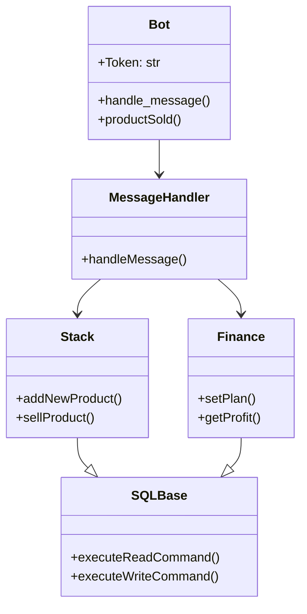
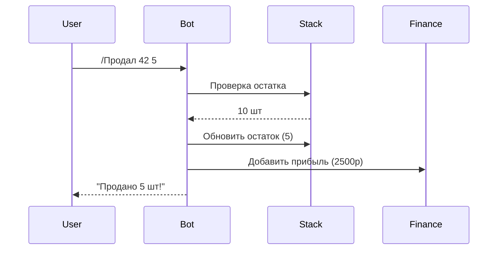
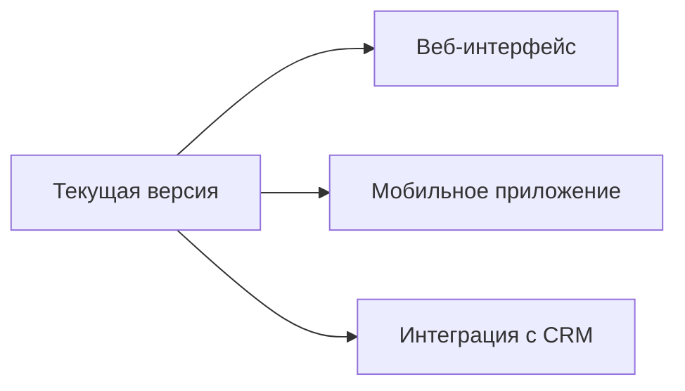

# 📑 Отчёт о разработке Telegram-бота для управления складом и финансами

## О проекте
**Finance Bot** — это многофункциональный инструмент для автоматизации бизнес-процессов, разработанный для малого и среднего бизнеса. Бот позволяет:
- 📌 Централизованно управлять складскими запасами
- 💸 Контролировать финансовые показатели в реальном времени
- 📈 Анализировать прибыльность товаров
- 🤖 Получать отчеты прямо в Telegram-чат

## 📌 Этапы разработки

---

### 1. Планирование и проектирование
**Цели**:  
✅ Автоматизация учета товаров  
✅ Отслеживание финансовых показателей  
✅ Генерация отчетов в Excel  

**Выбор технологий**:
- [](https://www.python.org/) 
- [](https://docs.python.org/3/library/sqlite3.html)
- Telegram Bot API:
    - [](https://pypi.org/project/pyTelegramBotAPI/)
    - [](https://core.telegram.org/) 
- [
](https://xlsxwriter.readthedocs.io/)
- [](https://docs.aiohttp.org/en/stable/index.html)

---

### 2. Проектирование архитектуры
**Диаграмма компонентов**:


---

### 3. Настройка окружения
**Шаги**:
1. Инициализация репозитория:
   ```bash
   mkdir finance-bot && cd finance-bot
   git init
   ```
2. Установка зависимостей:
   ```python
   # requirements.txt
   python-telegram-bot==20.0
   xlsxwriter==3.1.2
   aiohttp==3.8.4
   ```
3. Создание структуры проекта:
```
├ FinanceBot.py      # Главный скрипт бота
├ databases/
│ ├── finance.db     # Финансовые записи
│ └── stack.db       # Данные склада
├ src/
│ ├── Database.py    # Базовый класс DB
│ ├── Stack.py       # Логика склада
│ ├── Finance.py     # Финансовые операции
│ ├── ExcelWriter.py # Генерация Excel
│ └── commands.py    # Обработчики команд
```


---

### 4. Реализация основных модулей
**a. Основной родительский класс базы данных (Database.py)**  
```python
import sqlite3, os, asyncio
from .ExcelWriter import excelWriter

class SQLBase(sqlite3.Connection):

    def __init__(self, database_path:str = "", table_name:str = 'STACK', primary_key_column:str = "product_id", fields:list = []) -> None:
        if self.checkDatabasesPath(database_path):
            super().__init__(database_path,5.0,0,"DEFERRED",True,sqlite3.Connection, 100, False)
            self.databasePath:str = database_path
            self.dataBaseTableName:str = table_name if not sqlite3.complete_statement(table_name) else ""
            self.primaryKey:str = primary_key_column                
            self.Cursor:sqlite3.Cursor = self.newCursor()
            self.__rowsCount:int = 0    
            self.fields:list = fields
            self.MAX_STRING_LINES:int = 100

    @property
    def rowsCount(self) -> int:
        try:
            self.__rowsCount  = len(list(self.executeReadCommand(f"SELECT {self.primaryKey} FROM {self.dataBaseTableName};").fetchall()))
        except:
            pass

        return self.__rowsCount
    
    def fieldsAreNotSQLCommands(self, fields:list) -> bool:
        for field in fields:
            if sqlite3.complete_statement(field):
                return False

        return True

    def getFieldsAverageSum(self, field) -> float:
        sumFromTable:float = 0.0
        if not sqlite3.complete_statement(field):
            sumFromTable = sum(int(row[0]) for row in self.executeReadCommand(f"SELECT {field} FROM {self.dataBaseTableName};").fetchall())
                 
        return round(sumFromTable/self.rowsCount, 2)

    def getFieldsSum(self, field) -> float:
        sumFromTable:float = 0.0
        if not sqlite3.complete_statement(field):
            sumFromTable= sum(int(row[0]) for row in self.executeReadCommand(f"SELECT {field} FROM {self.dataBaseTableName};").fetchall())
                
        return sumFromTable

    def revealDatabaseFields(self, *fields) -> sqlite3.Cursor:    
        return self.executeReadCommand(f"SELECT {','.join(list(fields))} FROM {self.dataBaseTableName};")

    def revealDatabaseString(self, len_of_list:int = 100) -> str:
        outputString:str = "Empty stack"
        for row in self.revealDatabaseFields(*self.fields).fetchmany(int(len_of_list)):
            outputString+=f"{' '.join(str(column) for column in row)}\n"

        return outputString
    
    def rowExists(self, field:str, field_data) -> bool:
        return True if self.executeReadCommand(f"SELECT EXISTS(SELECT 1 FROM {self.dataBaseTableName} WHERE {field}=?);", (field_data,)).fetchone()[0] else False 

    def checkDatabasesPath(self, path:str = "") -> bool:
        return os.path.exists(path)
        
    def newCursor(self) -> sqlite3.Cursor:
        return self.cursor()

    def executeReadCommand(self, command, *args) -> object:
        if sqlite3.complete_statement(command):
            return self.Cursor.execute(command, *args)

    def executeWriteCommand(self, command, *args) -> None:
        if sqlite3.complete_statement(command):
            self.Cursor.execute(command ,*args)
            self.commit()
    
    def setRowInfo(self, id:int, field:str, new_info) -> None:
        self.executeWriteCommand(f"UPDATE {self.dataBaseTableName} SET {field} = ? WHERE {self.primaryKey} = ?;", (new_info,id))

if __name__ == "__main__":
    database = SQLBase(os.path.join(os.path.dirname(os.path.abspath(__file__)), "test.db"))
    #database.executeWriteCommand("DROP TABLE STACK;")
    database.executeWriteCommand("""CREATE TABLE IF NOT EXISTS STACK(
    product_id INTEGER NOT NULL PRIMARY KEY AUTOINCREMENT, 
    name TEXT NOT NULL,
    remaining INTEGER NOT NULL,
    cost INTEGER NOT NULL,
    revenue INTEGER NOT NULL,
    profit INTEGER NOT NULL,
    profit_procent REAL NOT NULL,
    cost_1  INTEGER NOT NULL);
    """)
        names = ["Жёсткие диски","Процессоры", "Видеокарты"]
    for i in range(0,5):
        stack.executeWriteCommand("INSERT INTO STACK (name, remaining, cost, revenue, profit, profit_procent, cost_1) VALUES  (?, ?, ?, ?, ?, ?, ?);", (random.choice(names), random.randint(1, 1000), random.randint(1, 1000), random.randint(1, 1000), random.randint(1, 1000), round(random.random(), 2), random.randint(350,1000)))

    print(database.rowsCount)
    database.close()
```

**b. Логика склада (Stack.py)**  
```python
import sqlite3
from .Database import SQLBase
import os, random
class Stack(SQLBase): 
    def __init__(self, database_path: str = "stack.db") -> None:
        self.fields:list =  ["product_id", "name", "remaining", "cost", "revenue", "profit", "profit_procent", "cost_1"]
        super().__init__(database_path, "STACK", "product_id", self.fields)

    def getCompleteProfit(self) -> float:
        return self.getCompleteRevenue()-self.getCompleteCost()       
    
    def getCompleteProfitProcent(self) -> float:
        return round(self.getCompleteRevenue()/self.getCompleteCost(), 2)

    def getCompleteCost(self) -> float:
        return self.getFieldsSum("cost")

    def getCompleteRevenue(self) -> float:
        return self.getFieldsSum("revenue")

    def getAverageCostOne(self) -> float:
        return self.getFieldsAverageSum("cost_1")

    def getMostProfitableProduct(self) -> str:
        MostProfitableProduct:tuple = self.executeReadCommand(f"SELECT product_id, name, remaining, max(profit_procent) FROM {self.dataBaseTableName};").fetchone()    
        return "\t".join(str(field) for field in MostProfitableProduct) if MostProfitableProduct else None

    def addNewDataToRow(self, row,  remaining, cost, revenue, profit, profit_procent, cost_1) -> tuple:
        for key, newFieldData in enumerate([remaining,cost,revenue,profit]):
            row[key+2] = row[key+2]+int(newFieldData)

        row[5]=profit_procent if profit_procent else round(row[4]/row[3],2)
        row[6]=cost_1
        return row

    def addNewProduct(self, name:str, remaining:int, cost:int, revenue:int = 0, profit:int = 0, profit_procent:float = 0.0, cost_1:int = 0) -> None:
        if not self.rowExists("name", name):
            self.executeWriteCommand(f"INSERT INTO {self.dataBaseTableName} (name, remaining, cost, revenue, profit, profit_procent, cost_1) VALUES  (?, ?, ?, ?, ?, ?, ?);",(name, int(remaining), int(cost), int(profit), int(revenue), float(profit_procent), int(cost_1)))
            return

        row:tuple = self.addNewDataToRow(list(self.executeReadCommand(f"SELECT product_id, name, remaining, cost, revenue, profit, profit_procent, cost_1 FROM {self.dataBaseTableName} WHERE name = ?;", (name,)).fetchone()),remaining, cost, revenue, profit, profit_procent, cost_1)
        for key, field in enumerate(["remaining", "cost", "revenue", "profit", "profit_procent", "cost_1"]):
            self.setRowInfo(row[0], field, row[key+2])

    def getProductIDString(self, name) -> tuple:
        return self.executeReadCommand(f"SELECT product_id, name FROM TABLE {self.dataBaseTableName} WHERE name = ?;", (name,))
    
    def searchProductInfo(self, *args) -> tuple:
        args:list = [argument.split("=") for argument in args if argument]
        outputString:str = "Didn't find anything"
        results:list = self.executeReadCommand(f"SELECT {', '.join([field for field in self.fields])} FROM {self.dataBaseTableName} WHERE {' AND '.join([f'{argument[0]} = ?' for argument in args])};", tuple([argument[1] for argument in args])).fetchall()
        if results:
            outputString="ID\tName\tRemaining\tCost\tRevenue\tProfit\tProfit_procent\tCost_1\n"
            for row in results:
                outputString+=f"{' '.join(str(column) for column in row)}\n"

        return outputString
    
    def getProductInfo(self, id:int, field:str) -> tuple:
        if not sqlite3.complete_statement(field):
            return self.executeReadCommand(f"SELECT product_id, name, {field} FROM {self.dataBaseTableName} WHERE product_id = ?;", (int(id),)).fetchone()

    def deleteProduct(self, id:int) -> None:
        self.executeWriteCommand(f"DELETE FROM {self.dataBaseTableName} WHERE product_id = ?;", (id,))

if __name__ == "__main__":
    stack = Stack(os.path.join(os.path.dirname(os.path.abspath(__file__)), "test.db"))
    #stack.executeWriteCommand("DROP TABLE STACK;")
    stack.executeWriteCommand("""CREATE TABLE IF NOT EXISTS STACK(
    product_id INTEGER NOT NULL PRIMARY KEY AUTOINCREMENT, 
    name TEXT NOT NULL,
    remaining INTEGER NOT NULL,
    cost INTEGER NOT NULL,
    revenue INTEGER,
    profit INTEGER,
    profit_procent REAL,
    cost_1  INTEGER);
    """)
    names = ["Жёсткие диски","Процессоры", "Видеокарты"]
    for i in range(0,5):
        stack.executeWriteCommand("INSERT INTO STACK (name, remaining, cost, revenue, profit, profit_procent, cost_1) VALUES  (?, ?, ?, ?, ?, ?, ?);", (random.choice(names), random.randint(1, 1000), random.randint(1, 1000), random.randint(1, 1000), random.randint(1, 1000), round(random.random(), 2), random.randint(350,1000)))

    print(stack.revealDatabaseString(3))
    print(stack.getCompleteProfit())
    print(stack.getMostProfitableProduct(), end="")
    stack.close()
```


---

### 5. Интеграция компонентов
**Схема взаимодействия**:

Интеграция всех модулей в одном  
**Финансовый модуль (Finance.py)**  
```python
import asyncio, os
from telebot.types import Message
from telebot.types import InputFile
from telebot.async_telebot import AsyncTeleBot
from src.Stack import Stack
from src.Finance import Finance
from src.commands import commandsHandler
from src.ExcelWriter import excelWriter

class AsyncMessageSender:
    def __init__(self) -> None:
        self.replies_queue:list = []

    def __aiter__(self) -> object:
        return self

    async def __anext__(self) -> dict:
        if self.replies_queue:
            return self.replies_queue.pop()
         
        raise StopAsyncIteration
        
    async def sendMessage(self, reply) -> None:
        await reply["command"](reply["chat_id"], reply["reply_message"])  
        
    async def sendMessages(self) -> None:
        async for reply in self:
            await self.sendMessage(reply)
            await asyncio.sleep(1)

class MessageHandler:
    def __init__(self, bot, stackCursor:Stack, financeCursor:Finance) -> None:
        self.bot = bot
        self.stackCursor:Stack = stackCursor
        self.financeCursor:Finance = financeCursor
        self.messageCount:int = 0
        self.messageChunk:int = 20
        self.messageSenderTask:asyncio.Task = None
        self.AsyncMessageSender:AsyncMessageSender = AsyncMessageSender()

    def extractArguments(self, command:str) -> list:
        return command.split()[1:]

    def areValidArguments(self, command, args:list) -> bool:
        if self.bot.commands[command]["arguments_check"](args) and self.stackCursor.fieldsAreNotSQLCommands(args):
            return all(args)
        
        return False                    
    
    async def handleMessage(self, message:Message) -> None:
        command:str = message.text.split()[0].lower()
        reply_message:str = "Invalid command\nEnter /помощь to look at the commands"
        if command not in self.bot.commands.keys(): 
            await self.bot.send_message(message.chat.id, reply_message)
            return
     
        arguments = self.extractArguments(message.text)    
        reply_message = "Error: invalid arguments"
        if self.areValidArguments(command, arguments):
            reply_message = self.bot.commands[command]["function"](*arguments)
            if self.bot.commands[command]["text_to_print"]:
                reply_message = self.bot.commands[command]["text_to_print"].format(reply_message)
    
        self.AsyncMessageSender.replies_queue.append({"command":self.bot.commands[command]["bot_function"], "reply_message":reply_message, "chat_id":message.chat.id})
        
        if not self.messageSenderTask or self.messageSenderTask.done():
            self.messageSenderTask = asyncio.create_task(self.AsyncMessageSender.sendMessages())
            await self.messageSenderTask

class Bot(AsyncTeleBot):
    def __init__(self, token: str, stackCursor:Stack, financeCursor:Finance) -> None:
        self.token:str = token
        self.stackCursor:Stack = stackCursor
        self.financeCursor:Finance = financeCursor
        self.helpMessage:str = self.getHelpMessage()
        super().__init__(self.token)
        self.messageHandler:MessageHandler = MessageHandler(self, self.stackCursor, self.financeCursor)
        self.commands:dict = commandsHandler.getCommands(self, self.financeCursor, self.stackCursor)
        self.table_names:dict = {
            "STACK" : self.stackCursor,
            "FINANCE" : self.financeCursor
        }

    def setMessageHandler(self) -> None:
        self.add_message_handler(Bot._build_handler_dict(self.messageHandler.handleMessage))

    def isSalesNumberIncorrect(self, remaining:int = 0, sales_number:int = 0) -> bool:
        return True if not remaining and not remaining < sales_number else False

    def sendExcelFile(self, table_name:str) -> None:
        if table_name in self.table_names.keys():
            self.excelWriter:excelWriter = excelWriter(f"{self.table_names[table_name].dataBaseTableName}.xlsx")
            self.excelWriter.generateExcelFile(self.table_names[table_name])
            return InputFile(self.excelWriter.getFilePath())

    def getHelpMessage(self) -> str:
        with open("help.txt", "r", encoding="UTF-8") as file:
            return " ".join(file.readlines())

    def help(self) -> str:
        return self.helpMessage

    def productSold(self, id:int, sales_number:int) -> str:
        name, remaining, cost_1 = self.stackCursor.executeReadCommand(f"SELECT name, remaining, cost_1 FROM {self.stackCursor.dataBaseTableName} WHERE product_id = ?;", (id,)).fetchall()[0]
        month_id, current_month_revenue = self.financeCursor.getMonthProfitID(self.financeCursor.getCurrentMonth())
        if self.isSalesNumberIncorrect(remaining, sales_number):
            return ""

        self.stackCursor.setRowInfo(id, "remaining", int(remaining)-int(sales_number))
        self.financeCursor.setRowInfo(month_id, "real_profit", current_month_revenue + (cost_1 * int(sales_number)))
        return f"Sold!\nName\tRemaining\n{name}\t{int(remaining)-int(sales_number)}"

class Main:
    def __init__(self, token:str) -> None:
        
        self.stackCursor:Stack = Stack(os.path.join(f"{os.path.dirname(os.path.abspath(__file__))}\\databases", "stack.db"))
        self.financeCursor:Finance = Finance(os.path.join(f"{os.path.dirname(os.path.abspath(__file__))}\\databases", "finance.db"))
        self.excelWriter:excelWriter = excelWriter("")
        self.bot:Bot = Bot(token, self.stackCursor, self.financeCursor) 
        self.bot.setMessageHandler()

    def runBot(self) -> None:
        asyncio.run(self.bot.polling(non_stop=False, allowed_updates=["message"], interval=3, timeout=20))
    
if __name__ == "__main__":
    main = Main(token=argv[0])
    main.runBot()
```

---

### 6. Деплой
**Вариант 1: Docker**  
```dockerfile
FROM python:3.10
WORKDIR /app
COPY . .
RUN pip install -r requirements.txt
CMD ["python", "FinanceBot.py"]
```

**Вариант 2: Ручной запуск**  
```bash
python FinanceBot.py --token YOUR_BOT_TOKEN
```

---

## 📊 Результаты разработки

**Основные метрики**:
- 12 классов реализовано
- 2 базы данных (SQLite)
- 18 поддерживаемых команд

---

## Дальнейшее развитие
1. **Интеграция с CRM**  
2. **Мобильные уведомления**  
3. **Дашборд аналитики**  


 